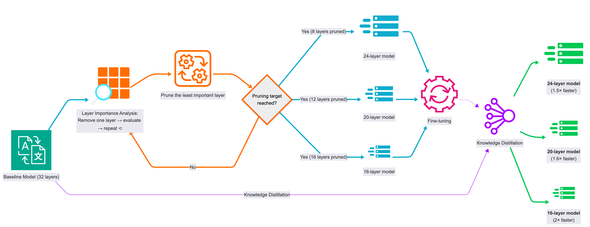

# Model-Compression

This repository includes the code of our two papers about iterative layer pruning:
* Efficient Speech Translation through Model Compression and Knowledge Distillation ([IWSLT 2025](https://aclanthology.org/2025.iwslt-1.40/))
* Iterative Layer Pruning for Efficient Translation Inference ([WMT 2025](https://aclanthology.org/2025.wmt-1.78/))





## Citations

Please cite the following papers:

```bib
@inproceedings{moslem-2025-efficient,
    title = "Efficient Speech Translation through Model Compression and Knowledge Distillation",
    author = "Moslem, Yasmin",
    booktitle = "Proceedings of the 22nd International Conference on Spoken Language Translation (IWSLT 2025)",
    month = jul,
    year = "2025",
    address = "Vienna, Austria (in-person and online)",
    publisher = "Association for Computational Linguistics",
    url = "https://aclanthology.org/2025.iwslt-1.40/",
    doi = "10.18653/v1/2025.iwslt-1.40",
    pages = "379--388",
    ISBN = "979-8-89176-272-5",
    abstract = "Efficient deployment of large audio-language models for speech translation remains challenging due to their significant computational requirements. In this paper, we address this challenge through our system submissions to the `Model Compression' track at the International Conference on Spoken Language Translation (IWSLT 2025). We experiment with a combination of approaches including iterative layer pruning based on layer importance evaluation, low-rank adaptation with 4-bit quantization (QLoRA), and knowledge distillation. In our experiments, we use Qwen2-Audio-7B-Instruct for speech translation into German and Chinese. Our pruned (student) models achieve up to a 50{\%} reduction in both model parameters and storage footprint, while retaining 97-100{\%} of the translation quality of the in-domain (teacher) models."
}
```

```bib
@inproceedings{moslem-etal-2025-iterative,
    title = "Iterative Layer Pruning for Efficient Translation Inference",
    author = "Moslem, Yasmin  and
      Al Farouq, Muhammad Hazim  and
      Kelleher, John",
    booktitle = "Proceedings of the Tenth Conference on Machine Translation (WMT 2025)",
    month = nov,
    year = "2025",
    address = "Suzhou, China",
    publisher = "Association for Computational Linguistics",
    url = "https://aclanthology.org/2025.wmt-1.78/",
    doi = "10.18653/v1/2025.wmt-1.78",
    pages = "1022--1027",
    ISBN = "979-8-89176-341-8",
    abstract = "Large language models (LLMs) have transformed many areas of natural language processing, including machine translation. However, efficient deployment of LLMs remains challenging due to their intensive computational requirements. In this paper, we address this challenge and present our submissions to the Model Compression track at the Conference on Machine Translation (WMT 2025). In our experiments, we investigate iterative layer pruning guided by layer importance analysis. We evaluate this method using the Aya-Expanse-8B model for translation from Czech to German, and from English to Egyptian Arabic. Our approach achieves substantial reductions in model size and inference time, while maintaining the translation quality of the baseline models."
}
```
